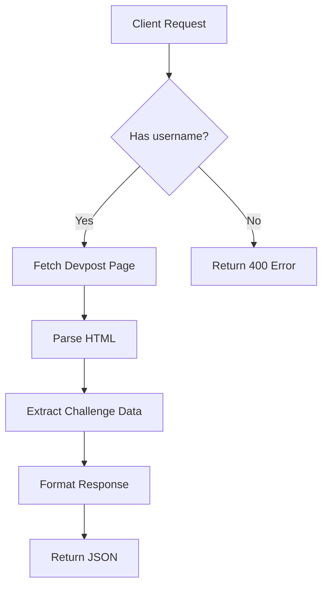

# Devpost Challenges API Documentation

A Node.js API to fetch featured challenges from any Devpost user's profile.

## Endpoint

`GET /challenges?username={devpost_username}`

## Parameters

| Parameter | Required | Description                     | Example         |
|-----------|----------|---------------------------------|-----------------|
| `username`| Yes      | Devpost username to look up     | `vansh-goel`    |

## Example Request

```bash
curl "http://localhost:3000/challenges?username=vansh-goel"
```

## Response

**Success (200 OK)**
```json
[
  {
    "title": "Electroneum Hackathon 2025",
    "url": "https://electroneum-hackathon-2025.devpost.com/...",
    "prize": "$52,500",
    "submission_deadline": "2025-03-07T12:00:00-05:00",
    "participants": 846,
    "featured": true,
    "description": "Create innovative...",
    "location": "Online"
  }
]
```

## Error Responses

**400 Bad Request**  
Missing username parameter:
```json
{
  "error": "Username parameter is required"
}
```

**500 Internal Server Error**  
Scraping failed:
```json
{
  "error": "Failed to fetch challenges",
  "details": "Specific error message..."
}
```

## Usage Examples

### Browser
```
http://localhost:3000/challenges?username=openai
```

### JavaScript
```javascript
fetch('http://localhost:3000/challenges?username=torvalds')
  .then(response => response.json())
  .then(data => console.log(data));
```

## Features
- Real-time Devpost data scraping
- Dynamic username parameter
- Clean JSON formatting
- Error handling with status codes
- Automatic data type conversion
- White-space normalization

## Key Implementation Details


> **Note:** This API performs live scraping on each request. Consider implementing caching if you need to reduce server load or improve response times.

## Development
```bash
# Install dependencies
npm install express axios cheerio

# Start server
node server.js
```

**Rate Limiting:** Not currently implemented - add middleware like `express-rate-limit` for production use.
